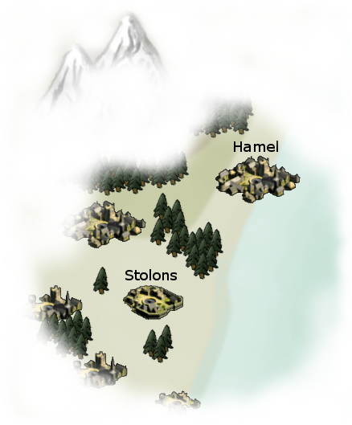

# Story : L'aventure des patates

## Sommaire

1. [Le monde de Gaia](#le-monde-de-Gaia)
2. [Histoire des patates](#préface--lavènement-des-hommes-patates)
3. [Les rêgles du jeu](#début--le-groupe-daventurier)
4. [Les peuples](#les-peuples)

## Le monde de Gaia

Le monde de Gaia est une planête bleu de petite taille avec un seul continent et deux lunes. Les deux lunes, Eva et Krah sont des satellites et génèrent des rayonnances lunaires très forte la nuit.

<i>Map monde de par les hommes patates.</i>

## Préface : L'avènement des hommes patates.

### Description :

Provenant de la terre et né par la magie, vous et votre peuple êtes une nouvelle ère de l'histoire de ce monde,
où reigne majoritairement les humains.
Protégé par un faible pacte de non aggression avec les humains, le seul village d'homme patate est souvent en proie à des agressions de toutes sortes.
Partez à l'aventure avec vos compagnons hommes patates découvrir ce monde et ces mystères.

### Préface :

Les patates, légumes souvent mangé gratiné ou en fritte, inoffensif, sans trop de difficulté pour pousser.
Les petites patates dite patates naines naissent ainsi à cause du sol qui a une composition trop riche en pierre;
les plus grosses patates naissent grâce à la riche composition fertile du sol.

Pourquoi moi narrateur, je vous parle de patates ?
Hé bien... tout commença après une pleine lune...
dans le village de Stolons réputé pour son sol fertile. 
Pendant une nuit, la brume épaisse avait recouvert le village. 
Dans le cimetière de ce village, un magicien maladroit "Markin" réputé pour être une bille en magie, avait prévu de se venger de ces rieurs d'habitant en utilisant un livre noir découvert auparavant en se cassant la gueule dans ce cimetière. Son projet était de se lever une armée de mort vivant et de zombie, pour attaquer le village.
Markin prononça des mots des enfers, puis il tourna la page et continua l'incantation pendant quelques minutes.
Au bout d'un moment, alors qu'il attendait que les morts sortent des tombes.. il vu des silouhettes sortir du sol du champs à côté... jusqu'à s'apercevoir en se rapprochant que ce n'était pas des morts vivant, mais des hommes patates ! Cette abruti avait donner naissance à des hommes patates... il avait sauté une page.

Il y avait des milliers d'homme patate tous différents : des costaux, des minces, des petits, des grands, des calmes, des nerveux...
La première réaction du magicien, a été de vouloir profiter de cette armée... même si ce sont des hommes patates, je pourrais toujours les manger en frite, qu'il se disait.
Les hommes patates esclaves de la magie de Markin, attaquèrent le village.
Ils étaient si puissants qu'ils ont fait de la purée d'humain, si bien qu'un homme patate berserker a tué aussi le magicien maladroit Markin dans la foulée.

Les patates qui avaient reçu la vie par magie, acquis une conscience par la libération du jou du magiciens.
Ils prirent place dans le village vide de Stolons, s'équipèrent, et renforcèrent les défenses du village afin de commencer une nouvelle ère. Le chef du village de Stolons est l'homme patate le plus sage, qui a reçu le pouvoir de Markin afin de faire naître les hommes patates. Chef Patarkin qu'il fut nommé en référence au pouvoir du magicien maladroit.

Au fil des années, le village de Stolons s'agrandit et malgré au début les attaques des humains pour reprendre le village et les contre-attaques des hommes patates pour défendre les innocentes patates des villages voisins; un traité de paix fut signé avec les villages humains environnants : Ceux-ci garantissaient l'égalité avec les hommes patates et les humains dans la contrée, si les hommes patates garantissaient que les hommes avaient le droit de manger des patates sans âme.

### Début : Le groupe d'aventurier

Vous êtes des patates nouvelles, récemment homme patate du village de Stolons ayant reçu éducation et entraînement suivant votre type de patate. Vous avez fait connaissance entre vous, pendant certains courts interclasse, devenu plus ou moins amis.

## Les peuples

Ce monde est composé de millier d'espèce différente dont certaines ont été créées par le mélange inter-espèce et d'autre par de la magie lunaire d'Eva ou Krah.

Voici les principales espèces dominantes de Gaia :
- Humain (34%)
- Mort-Vivant (18%)
- Orc (17%)
- Elfe 'global' (12%)
- Nain (8%)
- Sang-mêlé (5%)
- Autres (6%)
- Les hommes Patates (~300 personnes)
- Les hommes Poireaux (~120 personnes)