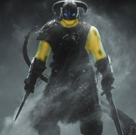
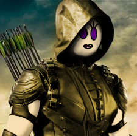
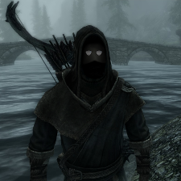
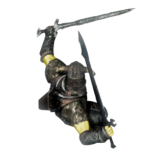
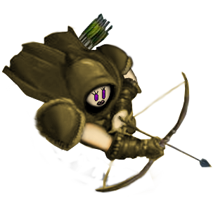
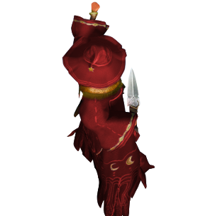
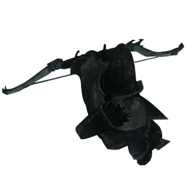
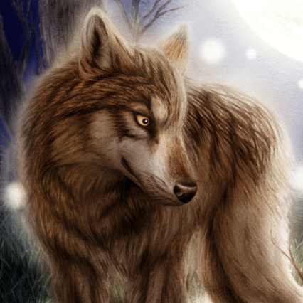
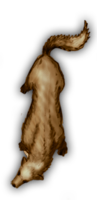

# Fiche des Personnages Existants #

Voici la liste des personnages existants.
Ces fiches de personnages peuvent données une ordre d'idée sur ce qu'il est possible de faire dans l'univers des patates.

## Fiche de personnage à la création

### Groupe A

[Baldor l'exécuteur](baldor.md) | [Inaya](inaya.md)
--- | ---
 | 

[Barial](barial.md) | [Bintje "DeadEye"](bintje.md)
--- | ---
 | 

### Groupe B

[Traven](traven.md) | [Inconnu](inconnu.md)
--- | ---
  | 
  

### Réserviste

[Erok](erok.md) | [Shrink](shrink.md)
--- | ---
  | 
  

## Fiches actuel

* [Baldor l'exécuteur](#baldor-lexécuteur)
* [Inaya](#inaya)
* [Barial](#barial)
* [Bintje "DeadEye](#bintje)

## Baldor l'exécuteur

De face | De dessus
--- | ---
 | 

Level | Race du personnage | Classe | L'ordre Magique | Posture Favorite
--- | --- | --- | --- | ---
3 | Homme patate | Guerrier | L'ordre de la patate d'eau (Eau) | Offensif : Max dégats

Vie | Mana | Mental | Physique | Social
--- | --- | --- | --- | ---
14 | 7 | 40% | 75% | 55%   

### Langues parlées
* Commun
* Goblin
* Nain

### Compétences :
* Forgeron : 15%
* Lames : 10%
* Maître d'arme : 5%
* Baratin : 15%

### Dons : 
* Charge puissante (1; Stun 1 ennemi + 1D4 de dégâts)
* Contre-attaque (1)
* Tourbillon (3)
* Bouclier de glace (3; génère un bouclier de glace sur une partie du corps pendant 3 tours)
* Barrage anti-projectile (1)
* Projection d'eau (2; project de l'eau avec pression)

### Inventaires :
* Armure de Plaque (indice 5)
* Tenue de discrétion
* Epée (D10; Ambidextre possible : +Malus)
* Epée Dentelé (D10 +2; Ambidextre possible : +Malus)
* Outils de forge
* Gourde d'eau x2
* Bourse : 228 PO
 
---

## Inaya

De face | De dessus
--- | ---
 | 

Level | Race du personnage | Classe | L'ordre Magique | Posture Favorite
--- | --- | --- | --- | ---
3 | Homme patate | Archer | L'ordre de la divine patate (Lumière) | Focus : Bonus de précision

Vie | Mana | Mental | Physique | Social
--- | --- | --- | --- | ---
11 | 10 | 60% | 70% | 40% 

### Langues parlées
* Commun
* Elfique
* Elémentaire

### Compétences :
* Ami des bêtes : 20%
* Arc : 20%
* Proche de son élément : 15%
* Toubib : 20% 

### Dons : 
* Sprint (1)
* Tir Précis (3; 10%; +3 de dégât + 1 cast)
* Création (Génère de l'élément; 1) [mecha impossible]
* Rédemption (Soigne X Vie pour Xx2 Mana dépensée, dure Xx3 en tour, Focus impossible)
* Oeil du Faucon (2; 35%, + 1 cast, actif pendant 3 tours)
* Foudre Divine (5; Inflige 1D10 + 2 de dégâts sur un ennemi)

### Inventaires :
* Arc à poulie (D10,  Ambidextre impossible, Bouclier impossible)
* Epée courte (D8; +Bonus vitesse)
* Armure Cuir (indice 2)
* Tenue de discrétion
* Ustensiles médicale
* Bourse : 477 PO
* Arc (D6, +2 dégâts)
 
---

## Barial

De face | De dessus
--- | ---
 | 

Level | Race du personnage | Classe | L'ordre Magique | Posture Favorite
--- | --- | --- | --- | ---
2 | Homme patate | Mage | L'ordre de la patate cuite (Feu) | Offensif : Max dégats

Vie | Mana | Mental | Physique | Social
--- | --- | --- | --- | ---
10 | 8 | 75% | 45% | 50% 

### Langues parlées
* Commun
* Druidique
* Démoniaque
* Elémentaire

### Compétences :
* Chercheur Scientifique : 10%
* Concentration : 5%
* Démoniaque : double les dégats magiques (Possibilité de se transformer en démon)
* Erudition : 15%

### Dons : 
* Création (Génère de l'élément; 1)
* Boule (1+; 1D6 dégâts + X de dégâts par X Mana en plus) 
* Méditation (Regen X Mana par X Tour)
* Barrière de flamme (3; génère une barrière de flamme à petite portée du personnage)
* Enflammation magique (2+; enflamme un objet, coût de maintien 1)

### Inventaires :
* Dague Ensorcelé (D6; +Bonus vitesse, +1 dégâts des sorts; Ambidextre : +Bonus)
* Bouclier Brassard di Luna (bouclier lune fixé sur le brassard; indice 1)
* Livre de sort (-1 cast OU +2 Mana; se porte en seconde main)
* Tenue de discrétion
* Bourse : 44 PO
 
---

## Bintje

De face | De dessus
--- | ---
 | 

Level | Race du personnage | Classe | L'ordre Magique | Posture Favorite
--- | --- | --- | --- | ---
2 | Homme patate | Druide | L'ordre de la patate aérée (Vent) | Focus : Bonus de précision

Vie | Mana | Mental | Physique | Social
--- | --- | --- | --- | ---
11 | 7 | 70% | 40% | 60%   

### Langues parlées
* Commun
* Druidique

### Compétences :
* Ami des bêtes : 20%
* Arc : 20%
* Chasseur né : 10%
* Observateur : 10%

### Dons : 
* Télépathie empathique avec les animaux et plantes (3; 1 tour de cast)
* Inconnu
* Inconnu
* Inconnu
* Inconnu

### Compagnon :

De face | De dessus
--- | ---
  |  

Level | Race | Vie | Mana | Mental | Physique | Social
--- | --- | --- | --- | --- | --- | --- | ---
1 | Loup | 20 | 0 | 60% | 60% | 50%   

<b>Description :</b>
MoonMoon était un loup de la meute de feu de la forêt des toufus. Cette meute est réputé pour avoir de violent combat avec la meute d'eau. C'est une meute assez offensive rendant l'apprivoisement impossible. Étrangement MoonMoon a été apprivoisé pendant un combat par Bintje, ce loup semble avoir une grande affinité avec Bintje et un lien plus fort que de maître les unis.

### Inventaires :
* Dague (D6; +Bonus vitesse; Ambidextre possible : +Bonus)
* Tenue de discrétion
* Ustensiles de chasseur
* Ustensiles de cuisine
* Dent de cochon de guerre
* Bourse : 14 PO