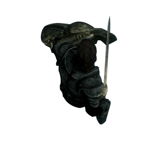

# Feuille de personnage Lv1 Erok

De face | De dessus
--- | ---
 | 

Race du personnage | Classe | L'ordre Magique | Posture Favorite
--- | --- | --- | ---
Homme patate | Guerrier | L'ordre de la pomme de terre (Terre) | Defensif : Bonus de défense, parade ou esquive

Vie | Mana | Mental | Physique | Social
--- | --- | --- | --- | ---
11 | 4 | 60% | 70% | 40%	

## Langues parlées
* Commun
* Nain
* Elémentaire

## Compétences :
* Bouclier : 15%
* Epée : 20%
* Concentration : 5%
* Peau dur : 10%

## Dons : 
* Contre-attaque (1)
* Création (Génère de l'élément; 1) [mecha impossible]
* Bouclier de terre (3)
* Peau de roche (4)

## Inventaires :
* Armure de Plaque (indice 5)
* Epée (D10; Ambidextre possible : +Malus)
* Bouclier Pavois (bouclier lourd d'archer; indice 3)
* Bourse : 10 PO