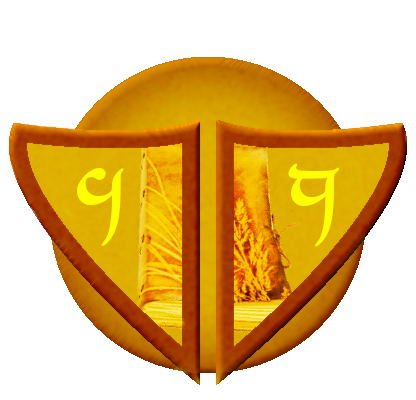

# La guilde du savoir

<i>Ce scénario peut-être jouer en même temps que : Un Beau Potager</i>

## Synopsis pour le MJ (à ne pas dévoiler aux joueurs...)

La guilde du savoir est d'origine de race haut-elfe, ils sont les adeptes du savoir, très avide d'en avoir toujours plus.
Il cherche à percer tous les mystères de ce monde et il n'hésite pas à utiliser leurs influances sur les églises et en politique pour avoir toujours plus de savoir. L'église de la lumière en particulier les aide souvent en le fournissant des cobayes volontaires... ou pas.
Un des principaux chef de la guilde nourrit le désire de posséder le bracelet de polymorphie, pour un enchantement particulier, qui lui permettrait de s'en servir pour contrôler les populations et mettre la guilde au centre du fonctionnement de ce monde, et d'instaurer la paix pour toutes les races.
Ce chef et initiateur de se projet est le grand sage Hilidmer.
Il a prévu de modifier l'enchantement de ce bracelet, afin de lui permettre de se transformer en n'importe quelle race. Ce qui favoriserais les dialogues après transformation et cela permettrait d'unifier les peuples sous sa bannière.
Pour la modification de l'enchantement, il a besoin en premier lieu du bracelet de polymorphie, d'une gemme spirituel de chaque race et d'un parchemin : Le parchemin du kaloum d'ogres.
Ils savent qu'un homme poireau en est/était détenteur, et qu'il se dirigeait vers la cité de Stolons en passant par Hamel.
Les hommes de la guilde du savoir sont en train d'espionner la population d'Hamel et se réunissent tous les soirs à la taverne de la bonne purée dans une pièce privée, afin de partager leurs informations journalières sur le bracelet.

## Récupérer la mission

* Si les aventuriers ne sont pas en possession du bracelet de polymorphie dans Hamel, ils ont la possibilité d'apercevoir dans la ville après une réussite critique en test d'observation que beaucoup de personne dans cette ville porte le même écusson. (Déroulement 1)

* Si les aventuriers sont en possession du bracelet de polymorphie dans Hamel, ils peuvent apercevoir un groupe de la guilde du savoir les suivre (Déroulement 1), si les aventuriers ne les remarquent pas alors ils se feront attaquer plus tard en sortant de Hamel (Déroulement 4).

* Si les aventuriers sont dans la taverne de la bonne purée le soir, il y a une ambiance assez malsaine qui met en éveille la méfiance des aventuriers, les poussant à chercher des indices dans la taverne. (Déroulement 2)

* Si les aventuriers sont dans une ville autre que Hamel, ils voyent Ernest un demi-elfe, qui les suit(Déroulement 3).

### Déroulement 1

La guilde veut posséder ce bracelet et ils seront prêt à tous pour.
Ils vont chercher et négocier le bracelet. Si les négociations donnent rien ils ont prévu de retourner la garde de la ville d'Hamel contre les patates aventurières. 
Il faut savoir qu'avant même l'idée de négociations, ils avaient déjà pris des mesures pour les tomber dessus en cas d'échec. De plus la tête de nos aventuriers sera automatiquement mises à prix.

* Si les aventuriers décident de vendre ou négocier le bracelet, la guilde va ramener le bracelet dans son palais fortifier de <b>Ahlkeim</b>, dans la montagne de Boaffroi afin de pratiquer le rituel.

* Si les aventuriers décident de ne pas vendre et qu'ils sont dans Hamel, ils ont le choix de fuir la ville de Hamel et de se faire traquer comme des bêtes. Ils se retrouveront dans la forêt verdatre.

* Si les aventuriers décident de ne pas vendre et de se rendre à Stolons, ils doivent passer ou repasser par <b>la forêt des toufus</b>.

* Si les aventuriers se séparent et/ou dont certains sont capturés, les capturés seront emmenés dans les douves du <b>palais fortifier de la guilde du savoir</b>, dans <b>la montagne de Boaffroi</b>. Ils seront torturés s'ils n'ont pas le bracelet et juste enfermé dans l'autre cas. Les restants seront poussés à aller sauver leurs compagnons.

### Déroulement 2

Le soir, dans la taverne de la bonne purée un groupe étrange s'isole dans une pièce de réunion. Deux gardes avec l'insigne de la guilde du savoir garde la porte. A l'intérieur, chaque participant donne les informations récoltées de la journée.

* Si les aventuriers décident d'écouter ou intérompre par la force la réunion, il y a un risque qu'il se fasse démasquer par les deux gardes et de déclancher une bagarre ainsi qu'une chasse à la patate dans la ville d'Hamel. Les patates étant très mal vue dans les villes humaines, il y a de forte chance que cela se finisse mal.

* Si les aventuriers décident d'intérompre la réunion par la parôle, il y a une possibilité (après jet de dés du MJ) pour que le groupe soit recruté pour retrouver le bracelet. Et si le groupe possède le bracelet alors des négociations peuvent se faire.

* Si les aventuriers passent leurs chemins sans possession du bracelet, ils verront Ernest les suivres (Déroulement 3).

* Si les aventuriers passent leurs chemins alors qu'ils sont en possession du bracelet : plus tard dans la ville d'Hamel ils peuvent voir un groupe de la guilde du savoir les suivres (Déroulement 1) ou/et se faire attaquer en sortie de ville (Déroulement 4).

### Déroulement 3

Ernest est un demi-elfe, un aspirant à la guilde du savoir qui a pour mission principale d'espionner les groupes d'aventuriers afin de retrouver le bracelet de polymorphie. Il n'est pas aggressif, ni méchant, mais il est avide de pouvoir et n'hésitera pas à se mettre au service d'autrui pour apprendre leurs connaissances. Il donnera facilement des informations sur la guilde du savoir et sur le bracelet, si cela peut lui permettre de l'avoir.

* Si les aventuriers ne possèdent pas le bracelet et décident de le tuer, ils auront aucune information et cela aménera automatiquement à ce que la guilde du savoir trouve le bracelet. Si ils possèdent le bracelet, alors dans un jour le groupe subira une attaque de la guilde du savoir.

* Si les aventuriers parle avec Ernest, ils verront en lieu un allier (Avec une réussite critique, les aventuriers peuvent comprendre qu'il cache quelques choses). Ernest donnera toutes les informations sur le bracelet et sur ce qui sait de la guilde du savoir.

Ce que sait Ernest :

* Il connait la puissance du bracelet de polymorphie, mais il a aucune connaissance des projets de la guilde.

* Il ne connait pas les chefs de la guilde du savoir.

* Il sait que la dernière personne à avoir possession du bracelet est Irgen. Et ceci, il l'a caché à ces maitres.

* Information caché : Ernest désir le bracelet pour devenir normal. Les demi-humains sont très mal vue dans ce monde. Ils sont crains de leur longue vie et rejeté par les autres races pour différentes raisons.

* Il sait où se trouve le Palais fortifié Ahlkeim.

### Déroulement 4

En sortant de la ville d'Hamel, rapidement le groupe subira une première attaque. Un groupe de mercenaire a la sorbe de la guilde du savoir. 

* Si les aventuriers gagnent, alors un des mercenaires révèleras que c'est la guilde du savoir qui a commendité et que d'autres groupes sont en route, et qu'il n'arreterons pas les attaques tant que les aventuriers seront en la posession du bracelet.

* Si les aventuriers perdent tous, alors ils serront capturés et envoyés au Palais fortifié Ahlkeim.

## Les lieux

### La montagne de Boaffroi
### Palais fortifié Ahlkeim
### Forêt Verdatre

La forêt Verdatre est réputé pour acceuillir une grande flore marécageuse. 
Elle est aussi connu pour être l'unique chemin pour la montagne de Boaffroi.
Il paraitrait que seule les membres de la guilde du savoir peuvent traverser cette forêt.

### Forêt des toufus

La forêt qui sépare Stolons d'Hamel est assez grande, avec une grande densitée d'arbre. Il y a des points d'eau, des sources et rivières, ainsi que beaucoup de bandit. Passer par la forêt est assez risqué, mais fait gagner de précieuse heure de marche par rapport à la route qui longe la plage.

* Si les aventuriers sont déjà passés, adapté le scénario pour ne pas avoir des incohérences avec d'autres missions. Les bandits sont dans tous les cas toujours sur les lieux, c'est juste que ce sont d'autres et situé à des endroits différents dans la forêt.

* Des légendes urbaines racontent, que des elfes sylvains vivraient dans cette forêt, mais aucun adulte n'a pu confirmer.

* Cette forêt est particulière, car deux meutes de loup se battent pour le territoire.

* Dalim l'ogre des forêts gardent le pont, et laisse uniquement pour des pièces d'or ou leurs nourritures <b><i>(La nourriture étant le plus important)</b></i>.

## La fin de la mission

## Annexes
### Les butins

### Table des rencontres & ennemis

**Stolons**

Name | HP/MP | Percentage | Dices | Equipment | Spell
:-----: | :-----: | :-----: | :-----: | :-----: | :-----:
Garde de la ville 1 (Guerrier) | 25hp / 6mp | 40/75/55 | D10 | Epée, Armure de plaque (4), 6PO | Charge puissante, contre-attaque
Garde de la ville 2 (Archer) | 20hp / 8mp | 55/75/40 | D8 | Arc à poulie, Armure de cuir (2), 6PO | Oeil de faucon

**Hamel**

Name | HP/MP | Percentage | Dices | Equipment | Spell
:-----: | :-----: | :-----: | :-----: | :-----: | :-----:
Garde de la ville 1 (Guerrier) | 25hp / 6mp | 40/75/55 | D10 | Epée, Armure de plaque (4), 6PO | Charge puissante, contre-attaque
Garde de la ville 2 (Archer) | 20hp / 8mp | 55/75/40 | D8 | Arc à poulie, Armure de cuir (2), 6PO | Oeil de faucon
Garde de la ville 3 (Cavalier) | 30hp / 4mp | 55/75/40 | D10 | Epée, Armure de plaque (5), 6PO | Charge puissante, contre-attaque

**La forêt des toufus**

Name | HP/MP | Percentage | Dices | Equipment | Spell
:-----: | :-----: | :-----: | :-----: | :-----: | :-----:
Loup | 20hp / 2mp | 40/50/45 | D6 | Peau de bête | Null
Loup Alpha | 30hp / 2mp | 60/70/40 | Peau de bête | Null
Ogre des forêts "Dalim" | 60hp / 8mp | 40/75/30 | D12 | Massue, Epée courte, Pagne, 2PO | Null
Bandit 1 (Archer) | 20hp / 4mp | 40/60/50 | D4, D6 | Dague rouillé, Arc,  4PO | Sprint(1)
Bandit 2 (Guerrier) | 30hp / 2mp | 50/60/60 | D12 | Epée longue à 2 mains, 4PO | Contre-attaque (1)
Elfe Sylvain 1 (Archer) | 20hp / 4mp | 40/70/50 | D8, D8 +1  | Arc elfique, Epée courte Elfique, Armure de cuir (2), 5PO | Sprint(1), Contre-attaque (1)
Arlendil (Archer) | 50hp / 8mp | 60/60/50 | D8, D8 +1 | Arc elfique, Epée courte Elfique, Armure de plaque (5), 15PO | Sprint(1), Contre-attaque (1), Tir Précis (3; 10%; +3 de dégât + 1 cast)

**La forêt Verdatre**

Name | HP/MP | Percentage | Dices | Equipment | Spell
:-----: | :-----: | :-----: | :-----: | :-----: | :-----:
Guerrier Mort-vivant | 20hp / 0mp | 40/65/40 | D6 | Epée et bouclier (1) | Null
Lancier Mort-vivant | 20hp / 0mp | 40/65/40 | D8 | Lance | Null
Archer Mort-vivant | 14hp / 0mp | 40/65/40 | D6 | Arc | Null
Soldat Mort-vivant | 20hp / 0mp | 40/65/40 | D10 | Epée longue, Armure de plaque (4) | Null
Mage Mort-vivant | 14hp / 10mp | 65/40/40 | D4 | Dague | Boule, Rayon
Crocodile Mort-vivant | 40hp/ 0mp | 40/70/40 | D8 | Dent | Null
Ours Mort-vivant | 35hp/ 0mp | 40/70/40 | D8 | Griffe | Null